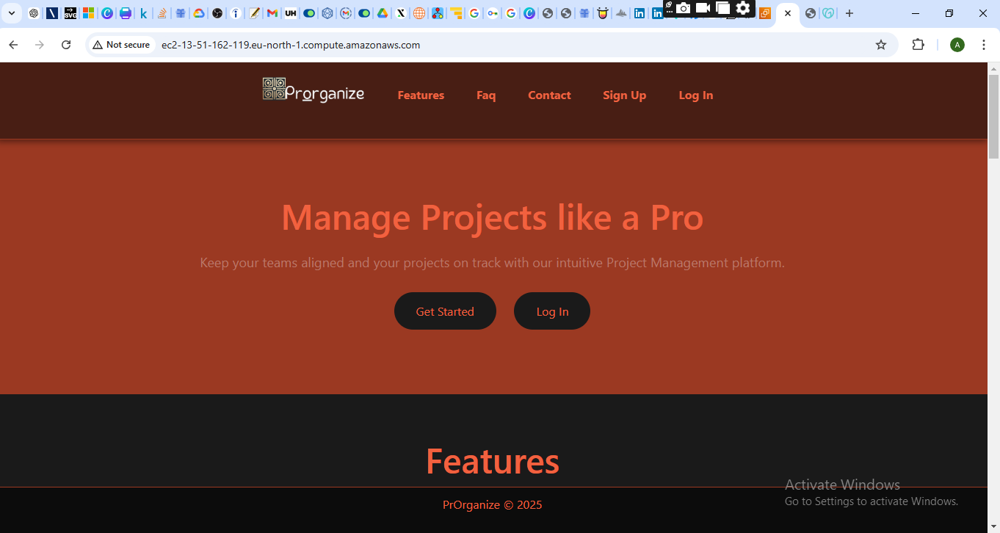
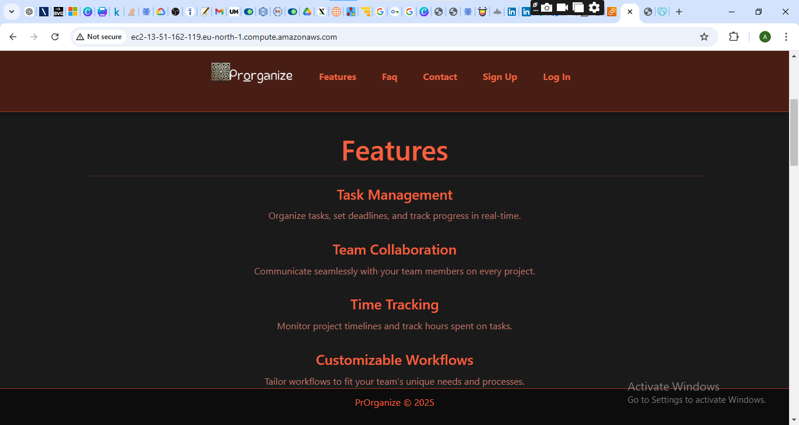
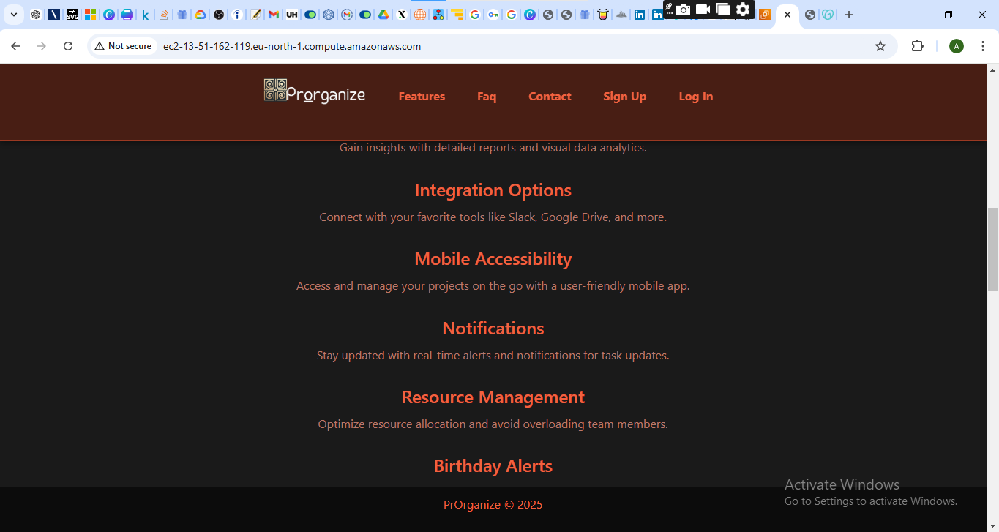
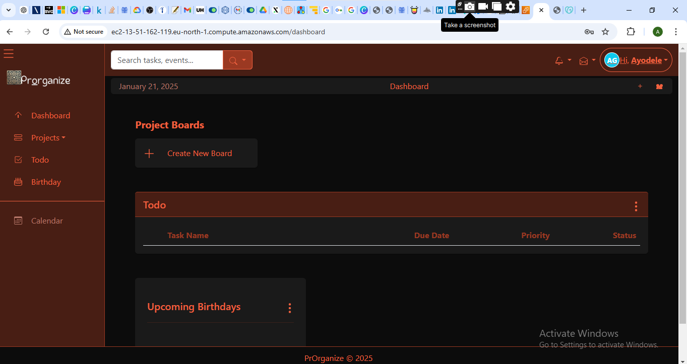
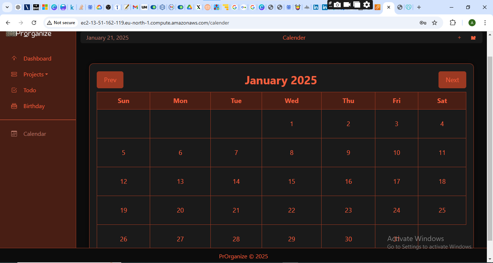

# 📝 Todo Manager  

A simple and efficient **Todo Manager** application built with **Flask** and **SQLite**, designed to help users organize their daily tasks effortlessly.  

## 🚀 Features  

- **Add, Edit, and Delete Tasks**: Easily manage your todos.  
- **Mark as Completed**: Track your progress with task completion.  
- **Due Dates & Priorities**: Stay on top of deadlines.  
- **User Authentication**: Secure login system for personalized task management.  
- **Responsive UI**: Built with Bootstrap for a smooth user experience.  

## 🛠️ Tech Stack  

- **Backend**: Flask (Python)  
- **Database**: SQLite  
- **Frontend**: HTML, CSS, Bootstrap  
- **Authentication**: Flask-Login  

## 📦 Installation  

1. Clone the repository:  
   ```bash
   git clone https://github.com/t70256242/Todo-Manager.git
   cd Todo-Manager
   ```  
2. Create and activate a virtual environment:  
   ```bash
   python -m venv venv
   source venv/bin/activate  # On Windows: venv\Scripts\activate
   ```  
3. Install dependencies:  
   ```bash
   pip install -r requirements.txt
   ```  
4. Run the application:  
   ```bash
   python app.py
   ```  
5. Open your browser and visit:  
   ```
   http://127.0.0.1:5000
   ```  

## 📸 Screenshots





  

## 👥 Contributing  

Want to improve **Todo Manager**? Feel free to fork the repository, make changes, and submit a pull request.  


## 👥 Author
Developed by Ayodele Ayorinde.

## 📄 License  

This project is licensed under the **MIT License**.  

